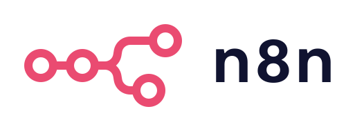
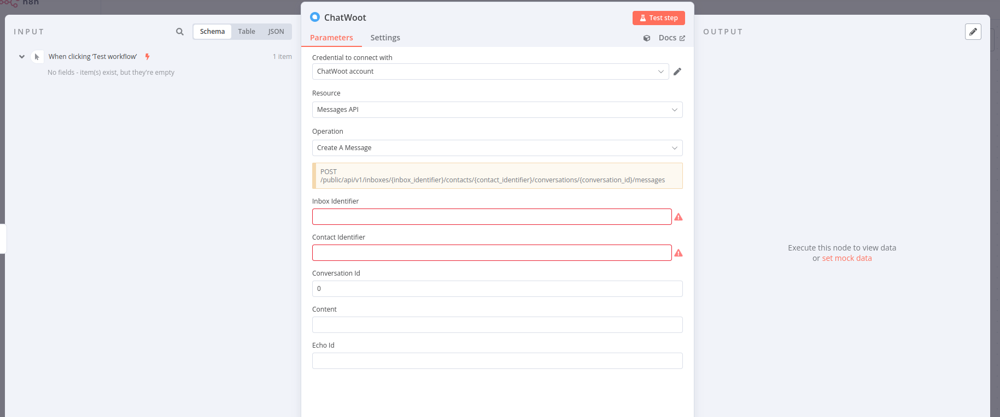

# @kuantia-ai/n8n-nodes-kuantia-crm

<p align="center">
  
  
</p>

Automate your
[**Kuantia CRM**](https://www.kuantia.co/)
workflows with
[**n8n**](https://n8n.io/)
!



[](https://www.npmjs.com/package/@kuantia-ai/n8n-nodes-kuantia-crm)

- GitHub: [kuantia-ai/n8n-nodes-kuantia-crm](http://github.com/kuantia-ai/n8n-nodes-kuantia-crm)
- npm: [@kuantia-ai/n8n-nodes-kuantia-crm](https://www.npmjs.com/package/@kuantia-ai/n8n-nodes-kuantia-crm)
- Kuantia CRM API reference: [https://api.kuantia.co/api/swagger-json](https://api.kuantia.co/api/swagger-json)
- 👉 Generated from
  [Kuantia CRM OpenAPI](https://api.kuantia.co/api/swagger-json)
  using
  [**kuantia-ai/n8n-openapi-node**](https://github.com/kuantia-ai/n8n-openapi-node)

# Tables of Contents

<!-- toc -->

- [@kuantia-ai/n8n-nodes-kuantia-crm](#kuantia-ain8n-nodes-kuantia-crm)
- [Tables of Contents](#tables-of-contents)
- [Installation](#installation)
- [Usage](#usage)
  - [Credentials](#credentials)
    - [Platform](#platform)
    - [User](#user)
    - [Inbox](#inbox)
- [Development](#development)

<!-- tocstop -->

# Installation
Install [the community node package in your n8n instance](https://docs.n8n.io/integrations/community-nodes/installation/gui-install/):
```
@kuantia-ai/n8n-nodes-kuantia-crm
```

# Usage
1. Install the community package to your n8n instance.
2. Add **Kuantia CRM API** **credentials** in **n8n**.
3. Create a new workflow with the **Kuantia CRM** node.

## Credentials
There are few types of credentials (accounts) that you can use to authenticate with Kuantia CRM API.

For different Kuantia CRM API Endpoints you'll need different credentials - please
refer to the [Kuantia CRM API documentation](https://api.kuantia.co/api/swagger-json) for more information.

We suggest you create **Kuantia CRM API** credentials in **n8n** for each type of account and name it `Kuantia CRM - {TYPE}` 
for better clarity.


### Platform
This token can be obtained by the system admin after creating a platformApp. This token should be used to provision agent bots, accounts, users and their roles.


### User
This token can be obtained by visiting the profile page or via rails console.


or **Super Admin** token in some cases


### Inbox
This token can be obtained by visiting the inbox settings page.


# Development
The node is generated from the
[Kuantia CRM OpenAPI](https://api.kuantia.co/api/swagger-json)
using
[**kuantia-ai/n8n-openapi-node**](https://github.com/kuantia-ai/n8n-openapi-node).

Likely the fix should be done in the OpenAPI specification file or in the generator itself.